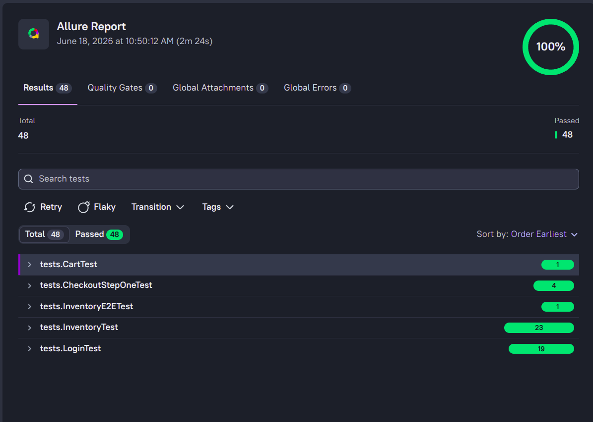
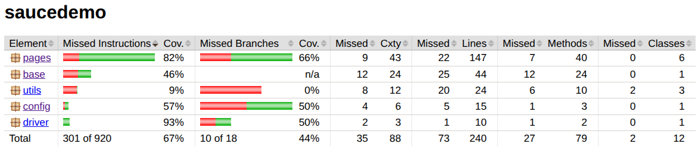

<!-- 1. Status and Quality -->
[](https://github.com/Nagraggini/sauce-demo/actions/workflows/ci.yml)
[](https://app.codacy.com/gh/Nagraggini/sauce-demo/dashboard?utm_source=gh&utm_medium=referral&utm_content=&utm_campaign=Badge_grade)

<!-- 2. Test data -->


<!-- 3. Technology and Tools -->


<!-- 4. Others -->


## Test Report


📊 [View the Allure Report](https://nagraggini.github.io/sauce-demo/allure-report/)


📊 [View the JaCoCo Coverage Report](https://nagraggini.github.io/sauce-demo/jacoco/)


## Project Overview

This project demonstrates a production-style Selenium automation framework built using the Page Object Model (POM).

Key features:

- Page Chaining
- Reusable BasePage architecture
- CI/CD with GitHub Actions
- JaCoCo coverage reporting
- Environment-based configuration
- Logging with Log4j2

## Getting Started

Prerequisites:
- Java Development Kit (JDK) 21 or higher
- Maven 3.x
- Chrome/Firefox WebDriver (or use WebDriverManager as included)

Terminal: 
./mvnw clean test
./mvnw clean test -Dtest=InventoryTest
./mvnw clean test -Dtest=InventoryTest#checkShoppingCartBadgeNumber
./mvnw test -Dgroups=regression

My tags:
smoke
regression
functional
end-to-end
ui

## Tech Stack

- Java 21
- Selenium WebDriver
- JUnit 5
- Maven
- Log4j2
- GitHub Actions
- JaCoCo
- WebDriverManager

# UML Diagrams

## 1. Core Framework & Utilities (Infrastructure Layer)
   
[](https://mermaid.live/edit#pako:eNp1Uk1Pg0AQ_SubiQeM2JTy0cLV6k1jrMbEcNnCCJvCLlkGY236312gVFp1Lzszb968gX07SFSKEEFS8LpeCp5pXsaSmdNV2FKLD9R3PCGlt2zXQ-25SjRywh631koVyCXLkacF1vUle8V1j130nP146o2S7yJ7Ms2ox0OvH7WqUJPAmlXH8GKkmiFZK9JCZmyD20vWx39pPGNNS078hURxsvi70DU98BKtgT4CDfVf7EtUZ-UTwScuU1X-ktNduWdZQhIrUGaUn60-an1oyrX5pf-2noiuzDOgrHNFv4SJb_AHto4PwtLusg9TmTSfey4BNmRapBCRbtCGEnXJ2xQ6gRgoxxJjiEyYcr2JIZYtp-LyTalyoGnVZPmQNFXa-qW32LEDpbHAjWokQRS4bjcCoh18QnTthO5kNveC-cKfh9NZ4NuwhchxvMk09MIwDMLA9YPQ39vw1ak6k8Cbeu4imPuLhQlmjg2YCmPd-4PL22tY5bZDhk14Q2q1lUmf778B5t76Hw)

## 2. Page Objects Architecture (Application Layer)

[](https://mermaid.live/edit#pako:eNqlVd9v2jAQ_lcibw-pBlXCj0CjvRTaSUhtQYOu0sSLGx_BwrGji0PHWPu3zwmEJpBtrZaHOPZ9393n852zJYFiQHwSCJokV5yGSKO5tMwzoAlMaAjW51_NpnWjQi7zqW-N5BKQ66QON5JrkFrh5g3YIUX9FtgSgpVK9VRDPJbwTsbsSZ0wdpx8y6_M7W41ez5YD_B4hXwNaLF8qLU9UK6tJ_MqW02iQkMT-fCxbFlwyezBxpgCajJ0ljm6FhCZfB3DLoWoIG94ol9e4S9lfCbgXmouvvGEPwr4Z4hPloohP0t7qpHL0EpRnFlrxVkZFIIepoiGeo_CPrN22DIiEEBxqNSKQ2KXHTyXE_xaOdsyecGFGMk41clBRQIoaQSNfSgrNvQnhexUWyB4sBrL3PVAS7tW_TWiwltIkmynVf0VgdWSrYikjM1UVqZj_AqRWh8yxjVEd0ZrbeDpUsWxQWXEAWUh3KXRI6DRwKvnYLAT5AGMF5dyZDyeemcqNUd6xDHVMdoj7H1t7IgvNbs7NNm2JoFFo9Qn8B3aqiFrGvbk7L9wTHTmKC-CwvuiWD0VlJFuaA1H0L9RJirRVAzNLVchxYflP1bXUJmukin8d4HVXUfbI19ZimfKSLKPEksaJETOiK8xhQaJACOaTUnuYU700rT3nPjmk1FczclcZpyYyu9KRQUNVRoui0kaM6phf9kfECAZmG5OpSZ-t-PmLoi_JT-I33Sdi_NWr9NreY7T7buu1yAb4nda585F13E9r93qtbttz3tukJ95VPfc6ziddr_nuO1-v--0uw0CjJsuu93_b7KhkHKdWwolNNVqupHBbv78G586G5M)

## 3. Test Execution Layer (Test Layer)

[](https://mermaid.live/edit#pako:eNqdVW1v2jAQ_iuRtw90pQhCoQVV1ShQCYkOVIqQJr648ZFYTezIdngpY799diAhLCnqlg8Y3z2Pn_Pd5bJFDieA2sjxsZQ9il2Bgzmz9POAJbyAVNbdr6sra8hdyuJt2xowDwRVsgg3YEtgiovNv2D7dv8T8K4HzhuP1ERBOGLwGQYWKgfbAzvCjQKtLseCLykBoRmVijWVIHpY4dSqmUHoQwzdM4-ZqFTuiwg9CIERYM5mPmel76nShEfCgYskgjjjBXFs927z3N1RpkAssAP390fzZbjHptxSf62AScpZl2vCWlnOfr34Zk2UgKSku1PtXOzb_9I4J5HWI3P0F2sGrz1Bl1qRxEuhb4apslb6J-vVyXc1zY-Xr0fPb0uCmoalC2vJKcnaFWDR4yuWc12aU6ixp304xi5k1RwfMNOnngAsmt1lT_3r7sdG2WYDgiBUmwELI_VIwSeyw8iLfl348BBN7gKpc0aVN2L-xtSN4QAKwDJyHJCLyE8JHd9P8EZqvJIlXS_KXCs6mMvWwRDqqFdckNQA6xAcBWT6PCxbr5ybdBwkZF7bMe9nXwgunrRf52bInTcgo0iZAD66XszKI59hIUB6OuLsiaUz6T6dPNucxsTjYahvZYbCAyYu_IiCVxAfhdTpTp5Bt6GECRfqnHDRXMrLa8ChHPuy900bFFXQ45FPelSGPt5k7_7IxZhLhf2untgF3bwQPIhTN2WK-klQn8pYMn_zUY8F1cUesRdPAJh-l2czkczbkxk2G4yT6bVDZeQKSlBbiQjKKAARYLNFMWOOlKdH7Ry19V-CxdsczZnhhJj95DxIaIJHrpdsopBgBYdPV4owE1h0ecQUajdbzfgI1N6iNWpf2a1mpXlTb9qtar1q12u1RhltjP22Um01bPv61r6uG_-ujN5jWbvSaNWqtVa9eW3Xmo2afVNGQKjO3dPh82mWJJZ-7ElCwZHikw1z9vvdH7u5cqw)

## Architecture Highlights

The framework follows a layered architecture:

- Infrastructure Layer
  - Driver management
  - Configuration
  - Logging
  - Shared utilities

- Application Layer
  - Page Objects
  - Page Chaining navigation

- Test Layer
  - Test classes
  - Test data
  - Assertions

This separation improves maintainability, scalability, and test readability.

## Example: Page Chaining

```java
InventoryPage inventoryPage =
        loginPage.login(validUser, validPassword);

CartPage cartPage =
        inventoryPage.addBackpackToCart()
                     .openCart();

CheckoutStepOnePage checkoutPage =
        cartPage.clickCheckout();
```

# Folder structure

```bash
saucedemo/
├── pom.xml
├── src/
│   ├── main/
│   │   └── java/
│   │       ├── base/          # Shared base functionality (e.g., BasePage)
│   │       ├── pages/         # Page Object classes
│   │       ├── driver/        # WebDriver initialization and management
│   │       ├── config/        # Configuration management
│   │       └── utils/         # Utility/helper classes
│   └── test/
│       └── java/
│           ├── base/          # Base test classes (e.g., BaseTest)
│           ├── data/          # Test data providers
│           └── tests/         # Test cases
└── target/                    # Compiled files and generated reports (e.g., JaCoCo)
```
## Logging

The framework uses Log4j2 for:

- Test execution logs
- Error tracking
- Debug information
- CI troubleshooting

## Configuration

Sensitive data is managed through:

- GitHub Secrets (CI environment)
- Local config.properties (development environment)

The framework automatically resolves values from environment variables first, then falls back to local configuration.

## CI/CD

GitHub Actions automatically:

- Build the project
- Execute tests
- Generate JaCoCo reports
- Publish coverage reports to GitHub Pages
  
